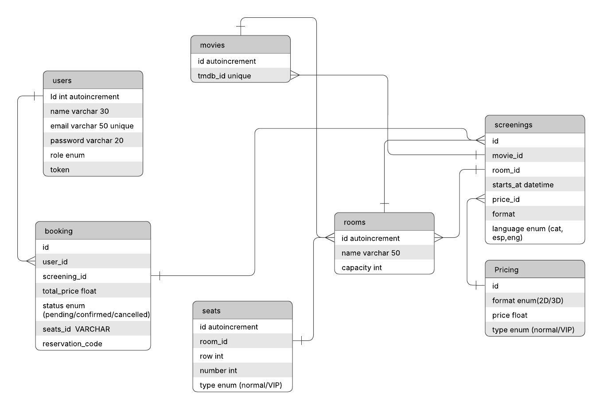

# TR3 Cinema - Tiquet Master

Sistema de reservas de entradas de cine con seleccion de asientos en tiempo real.

## Descripcion del Proyecto

Plataforma web para la compra de entradas de cine que permite:
- Ver cartelera de peliculas
- Seleccionar sesion (fecha y hora)
- Elegir asientos de forma grafica e interactiva
- Realizar pago con Stripe
- Generar entrada PDF con codigo de reserva

## Tecnologia

- **Frontend**: Nuxt (Vue.js) - puerto 3001
- **Backend API**: Laravel - puerto 8000
- **WebSockets**: Node.js + Socket.IO - puerto 3000
- **Base de datos**: MySQL 8.0
- **Cache/Tiempo real**: Redis
- **Docker**: Contenedores para todos los servicios

## Diagramas del Sistema


## Diagrama Entidad-Relacion



## Base de Datos

**Seeder**: El archivo para poblar la base de datos se encuentra en:
- `backend-laravel/database/seeders/DatabaseSeeder.php`

Comando para ejecutar el seeder:
```bash
docker exec tiquet_laravel php artisan migrate:fresh --seed
```

## Acceso

- **Frontend**: http://204.168.252.153:3001/

## Credenciales de Prueba

- **Usuario**: user@example.com / 123users

---

Paula Vera